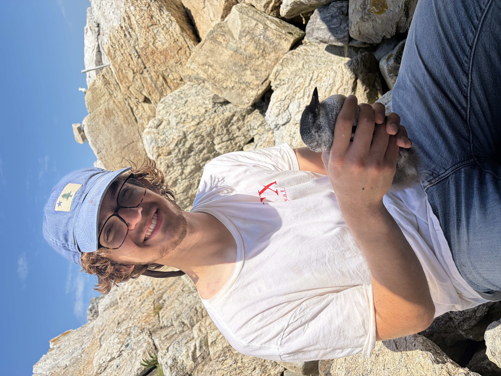

## Hello, my name is Charles. Here is some information about me:

- I love birds! I am here at Cornell studying to be an ornithologist
- I love singing. I am part of the Cornell Glee Club, and I've been in choirs for most of my life
- I love to draw and paint. I mostly sketch birds, but I like painting many other things as well
- I've had the great fortune of seeing the painting by Caravaggio on the home page in person at the Villa Borghese. I was so struck by it that it instantly became my most favorite work of art

{fig-align="center" width="436"}
